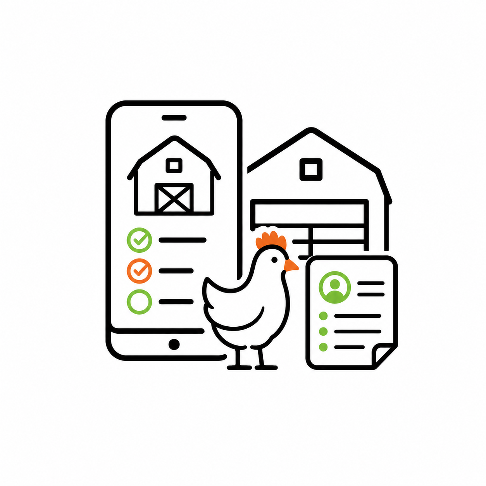

<p align="center">
  
  <h1>SimpleAgriData - Poultry Inspection App (ehem. Stallkarten App)</h1>
</p>

## Beschreibung
Open-Source-App zur digitalen Durchgangsdokumentation in der Hähnchenmast. Sie ermöglicht die Erfassung und Verwaltung von Protokollgängen und wurde im Rahmen des Forschungsprojekts SimpleAgriData an der Hochschule Karlsruhe entwickelt.


## Run

```bash
docker compose -f local.docker-compose.yaml up --build
```

Verfügbarkeit: [http://localhost:3000/](http://localhost:3000/)
